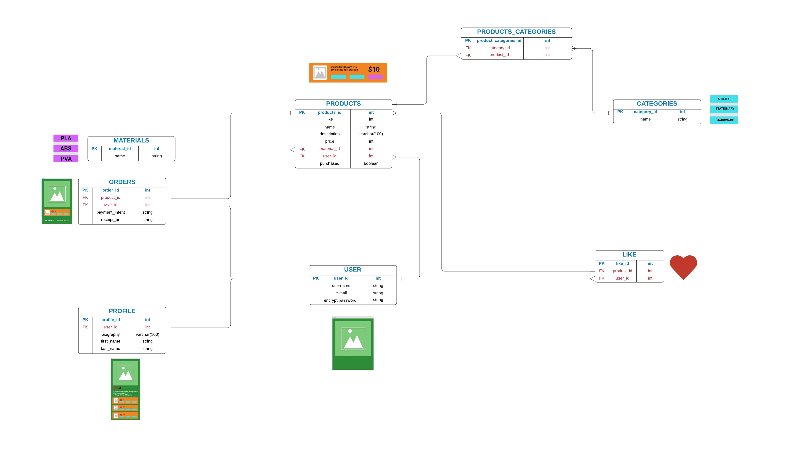

# README

### **Ruby version:**  
    2.7.2 

### **Rails version:**  
    6.1.3

### **Identification of the problem you are trying to solve by building this particular marketplace app.**

Many websites offer ways to download 3D printable files, but these websites have an issue in certain ways. Thingyverse.com helps people to search and import free files. That's fantastic. But there's a problem. Our rival has turned into a repository for replica items to be uploaded, or snatched and re-purposed as someone else's. Print it is attempting to address this issue by being a'middle exchange control framework.' We allow users to upload highly designed and specialised items while also giving them the protection to exchange files for profit.

### **Why is it a problem that needs solving?**

3D printing enthusiasts and working professionals devote so much effort to perfecting and crafting their creations that it becomes an embarrassment and a great burden for the artist not to generate money for sharing their gifts with the world. Before it was printed, artists had to accept no recompense for their works, or even hope that customers would donate to Thingyverse account, which rarely happens. Print it allows the user total freedom, allowing them to build their own rules for how and for how long they want to market their 3D printable marvels. Print it also contains backup logs of the files purchased in case you forget the purchased files or they get corrupt, which distinguishes us from out competitors.

### **A link (URL) to your deployed app (i.e. website)**

[Deployed Site](https://intense-ridge-12720.herokuapp.com)

### **A link to your GitHub repository (repo).**

[print it.com](https://github.com/ryanTavcar/Rails_marketplace_app)

### **Description of your marketplace app (website), including:**

- **Purpose**
  Print it aspires to be a portal that attracts customers because of its middle exchange control framework functionality, which allows customers to securely exchange files for payment between them. Print also allows people to keep track of their own 3D printable products that they have amassed, products that they have bought, and products that they have admired. This gives customers trust that if they lose the files they've purchased, re-downloading those files is never a problem.

- **Functionality / features**
    - Payment for files.
    Print it offers a safe and securly format to process payment for files.

    - User profile page.
    As well as being a safe and sercure portal to trade finace to files. Print it also offers social features that allows user to build and brand their own profile.

    - Liking of 3D printable files.
    Inspiration hits wherever it strikes, and for many people in this day and age, inspiration strikes when browsing similar items by other users on social media. The last thing you want to happen is for your inspiration to disappear! So, print it unlocks a liking feature that saves a record of that product on your profile page. It's also a perfect way to spread collective spirit by displaying your love for fellow 'print-it-ers.'

    - Log of purchased files.
    As with being a secure platform for goods transfer. Print it even maintains a list of the files you've purchased on your profile page. This enables print it to recommend more and better files suited to your tastes, as well as to provide a secure link to re-download missing or misplaced files.

- **Sitemap**

- **Screenshots**
- **Target audience**
- **Tech stack (e.g. html, css, deployment platform, etc)**
breif description of each point.
    - Rails
    - HTML
    - Sass
    - Heroku
    - Devise
    - Amazon S3
    - Postgresql
    - Jruby
    - Rubocop
    - Figma
    - Lucidchart
    - Stripe

### **User stories for your app**

.

### **Wireframes for your app**

.

### **An ERD for your app**

### **Explain the different high-level components (abstractions) in your app**
views, controllers, routes
how app works to someone non technical.

.

### **Detail any third party services that your app will use**

- Stripe
    Stripe is an Irish-American financial services and software as a service company dual-headquartered in San Francisco, California and Dublin, Ireland. The company primarily offers payment processing software and application programming interfaces for e-commerce websites and mobile applications.

- Amazon S3
    Amazon S3 or Amazon Simple Storage Service is a service offered by Amazon Web Services that provides object storage through a web service interface. Amazon S3 uses the same scalable storage infrastructure that Amazon.com uses to run its global e-commerce network
    
### **Describe your projects models in terms of the relationships (active record associations) they have with each other**

The models used associate with eachother in perhaps a standard way. The assocations mostly used are; one-to-one relations, one-to-many and when there is a many-to-many relations, like that between our product model and material model.

- one-to-one relationship:

- one-to-many relationship:

- many-to-many relationship:

### **Discuss the database relations to be implemented in your application**
talk about foreign keys, tables
.

### **Provide your database schema design**
migrations
.

### **Describe the way tasks are allocated and tracked in your project**
project management
.
