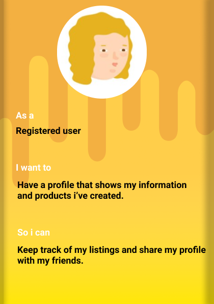
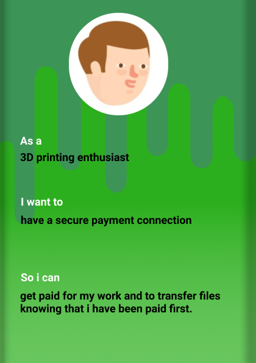
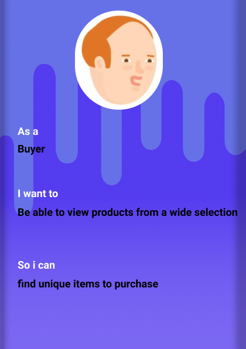
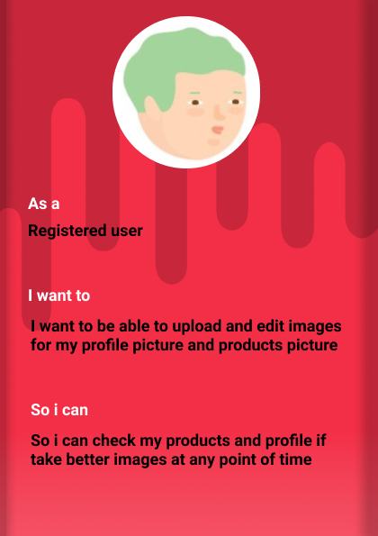
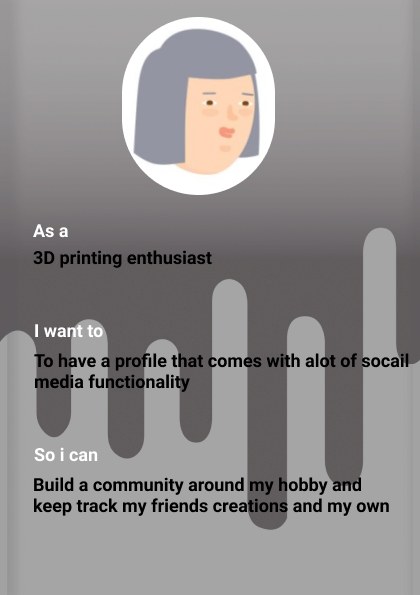
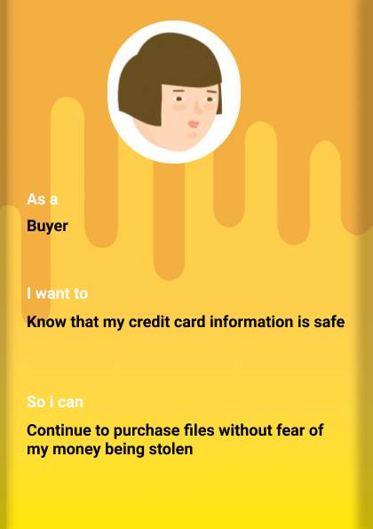
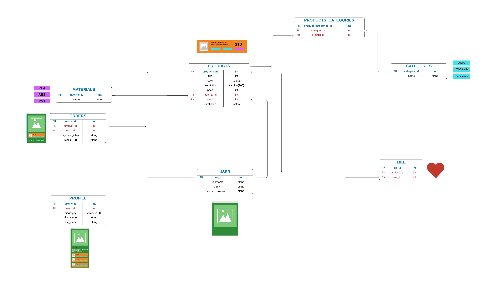

**RAILS MARKETPLACE ASSIIGNMENT README**
====================================

Ruby version
============
2.5.7 (This ruby version was used as i deployed to heroku with windows, which requires JRuby. The Jruby installed requires the use of Ruby version 2.5.7) 

Rails version
==============
6.1.3

Setup
=====
1. Make a fork of this repository.
2. Clone your fork to your local development environment.
3. Navigate into this directory via your terminal.
4. Install dependencies 'bundle install'.
5. Check node dependencies 'yarn install --check-files'
6. run 'rails db:create' to create the database.
7. run 'rails s' and check that everything is working (you should see welcome to rails!)

Identification of the problem you are trying to solve by building this particular marketplace app.
===================================================================================================

Many websites offer ways to download 3D printable files, but these websites have an issue in certain ways. Thingyverse.com helps people to search and import free files. That's fantastic. But there's a problem. Our rival has turned into a repository for replica items to be uploaded, or snatched and re-purposed as someone else's. Print it is attempting to address this issue by being a'middle exchange control framework.' We allow users to upload highly designed and specialised items while also giving them the protection to exchange files for profit.

Why is it a problem that needs solving?
=======================================

3D printing enthusiasts and working professionals devote so much effort to perfecting and crafting their creations that it becomes an embarrassment and a great burden for the artist not to generate money for sharing their gifts with the world. Before it was printed, artists had to accept no recompense for their works, or even hope that customers would donate to Thingyverse account, which rarely happens. Print it allows the user total freedom, allowing them to build their own rules for how and for how long they want to market their 3D printable marvels. Print it also contains backup logs of the files purchased in case you forget the purchased files or they get corrupt, which distinguishes us from out competitors.

A link (URL) to your deployed app (i.e. website)
=================================================

[Deployed Site via Heroku](https://intense-ridge-12720.herokuapp.com)

A link to your GitHub repository (repo).
=======================================

[My github repository for this assignment](https://github.com/ryanTavcar/Rails_marketplace_app)

Description of your marketplace app (website), including:
=========================================================

- **Purpose**

  Print it aspires to be a portal that attracts customers because of its middle exchange control framework functionality, which allows customers to securely exchange files for payment between them. Print also allows people to keep track of their own 3D printable products that they have amassed, products that they have bought, and products that they have admired. This gives customers trust that if they lose the files they've purchased, re-downloading those files is never a problem.

- **Functionality / features**
    - Payment for files.

    Print it offers a safe and securly format to process payment for files.

    - User profile page.

    As well as being a safe and sercure portal to trade finace to files. Print it also offers social features that allows user to build and brand their own profile.

    - Liking of 3D printable files.

    Inspiration hits wherever it strikes, and for many people in this day and age, inspiration strikes when browsing similar items by other users on social media. The last thing you want to happen is for your inspiration to disappear! So, print it unlocks a liking feature that saves a record of that product on your profile page. It's also a perfect way to spread collective spirit by displaying your love for fellow 'print-ers.'

    - Log of purchased files.

    As with being a secure platform for goods transfer. Print it even maintains a list of the products you've liked on your profile page. This enables print it to recommend more and better files suited to your tastes, as well as to provide a secure link to re-download missing or misplaced files.

- **Sitemap**

- **Screenshots**

**Home Page**

**Profile Page**

**Sign in Desktop**

**Sign in Tablet**

**Product Page Not Signed In**

- **Target audience**

    The target audience i expect to use this app are; 3D printing enthusiasts, people who want an app that provides socail media functionaly focused around 3d printing, 3D printing professionals and people who want to engage with the 3D printing community. Seeing the user stories below may give you more aof a weel rounded information on who the target audience is expected to be.

- **Tech stack (e.g. html, css, deployment platform, etc)**

    - Rails

    Ruby on Rails, or Rails, is a server-side web application framework written in Ruby under the MIT License. Rails is a model–view–controller framework, providing default structures for a database, a web service, and web pages

    - HTML

    Hypertext Markup Language is the standard markup language for documents designed to be displayed in a web browser. It can be assisted by technologies such as Cascading Style Sheets and scripting languages such as JavaScript

    - Sass

    Sass is a preprocessor scripting language that is interpreted or compiled into Cascading Style Sheets. SassScript is the scripting language itself. Sass consists of two syntaxes. The original syntax, called "the indented syntax," uses a syntax similar to Haml.

    - Heroku

    Heroku is a cloud platform as a service supporting several programming languages. One of the first cloud platforms, Heroku has been in development since June 2007, when it supported only the Ruby programming language, but now supports Java, Node.js, Scala, Clojure, Python, PHP, and Go.

    - Devise

    Devise is a flexible authentication solution for Rails based on Warden. It: is Rack based, is a complete MVC solution based on Rails engines, allows you to have multiple models signed in at the same time, is based on a modularity concept: use only what you really need

    - Postgresql

    PostgreSQL, also known as Postgres, is a free and open-source relational database management system emphasizing extensibility and SQL compliance. It was originally named POSTGRES

    - Jruby

    JRuby is an implementation of the Ruby programming language atop the Java Virtual Machine, written largely in Java.

User stories for your app
==============================

Wireframes for your app
==============================

**Wireframes for desktop**

**Wireframes for tablet**

**Wireframes for mobile**

An ERD for your app
===================

Explain the different high-level components (abstractions) in your app
=======================================================================

I'll start of first by explaining how i tried to best utilise the views.

The views maintains the display logic. It indicates the user interface. In Rails, the view is the HTML files that have Ruby code. I tried as much as possible t seperate heavy conditional use by placing chucks of code into view helper modules as well as creating view partials. For example, in the product show page, the 'like' system was becoming unruly and hard to read. In order to create a liking system without javascript and just using pure ruby code, i had to first create a few dintict features. The first feature being a helper method that checks if the current user has or has not already liking the product being viewed. Then i created a partial that incorporated that helper method to render a button (in the shape of a heart) that adds a like to the product if the current users id is not present in the like table (see figure ) if the users id is present, delete a like from the product. In conjuction with the button, i also created another helper method that checks the grammar of the word 'like'. If @product.likes.count is equal to 1, then display the word 'like', for sigular. If @product.likes.count is equal to any other number, then display the word 'likes', for plural.

The controllers are the next abstraction i'll discuss.
The controllers control the flow of the application. The controller interacts with both views and models. The requests coming from the browser are processed by the controllers. These controllers process the data from the models and forwards it to the presentation views.
In my app, I tried my best to keep controllers limited to just the CRUD methods (beside private methods), However i did expand my controller methods when i wanted to incorporate distinct pages that i felt did not warrant their own controller. Those pages would be; the profile settings page and the profile liked products pages. 

Detail any third party services that your app will use
======================================================

- Stripe
    Stripe is an Irish-American financial services and software as a service company dual-headquartered in San Francisco, California and Dublin, Ireland. The company primarily offers payment processing software and application programming interfaces for e-commerce websites and mobile applications. I used stripe to process payment between buys and sellers of my app. I enjoyed using Stripe as it felt intuitive in conjunction with Rails. I also enjoyed the UI dashboard that Stripe provides on their website.

- Amazon S3
    Amazon S3 or Amazon Simple Storage Service is a service offered by Amazon Web Services that provides object storage through a web service interface. Amazon S3 uses the same scalable storage infrastructure that Amazon.com uses to run its global e-commerce network. I used and S3 bucket to store images that a user might upload, such as a product image and a profile page image. I also used the same bucket to store either .gcode or stl files that the user uploads. Those files are then retrieved after a user buys a product. 
    
Describe your projects models in terms of the relationships (active record associations) they have with each other
==================================================================================================================

The models used associate with eachother in perhaps a standard way. The assocations mostly used are; one-to-one relations, one-to-many and a many-to-many relations, like that between our product model and category model.

- one-to-one relationship:
    There are two models that have a one to one relationship, those being between the user table and the profile table. The user table has one profile table and the profile table belongs to a user, this allows the profile to be able to references a user to the profile table. I like to think of belongs to and has one associations with a Toy Story analogy; Andy has a toy named Woody and Woody belongs to andy.. and where is the forenign key 'Andy' that binds Woody to Andy.. at the bottom of Woody sole of course.
- one-to-many relationship:
    This association indicates that each instance of the model has zero or more instances of another model. The first example that comes to mind is my user table and like table. My like table belongs to each user and each user can have many likes and give many likes to many different products (but of course, due to how the like table was utilised in the products#show page, a user can only give each product one like). 
- many-to-many relationship:
    I'm fine with wrapping my head around the kind of thinking belonging to one to one relationships, and even one to many. What took be a while to wrap my head around were many to many relationships which demand a join table. Presenting many to many relationship by abstracting tables into this format (see figure below) helps to visualize what a join tables purpose really is. In this example, product 1 is referenced in Product_catergory table, listed under ProductCategory_id 1. Product Category_id 1 also references 3 ids from the Category table, 1,2 and 4. Stationary, Utility and Mechanical. Many to many relationships allow each product to have many categories associated with it.

Discuss the database relations to be implemented in your application
====================================================================

Creating a database and how they all relate to one another was something that took me awhile to 'configure' my head around. After watching my rails conferences about models and database deign and also reading alot of ruby guides and blog posts, I found it very helpful to create and entity relationship diagram that was an abstraction of my erd (veiwed above). This abstractged erd dhowcases 'real data' and how their foreign keys actually relate to each table (view this erd below). 

Provide your database schema design
===================================

Please view my database schema, you can find it here: db\schema.rb. 
I created 18 migration during the time of the assignment. Some of these migrations are related to tables that requrie a foreign key, such as my material table and profile table. In fact, between the lines 124 and 134 of my schema.rb file, you can see with tables are referneced in other table with the add_foreign_key contraint. There are 11 foreign key constraits. My schema.rb rile has been mostly generated due to the migrations i imposed. Early on in the createion of my database, i originally had the Profile column 'first_name' and 'last_name' under the User table, However half way through the assignment, i felt that perhaps these two columns would best be in the Profile table, which you can see from my migration 'db\migrate\20210310002506_remove_first_name_from_profile_table.rb'. No changes were ever made directly to the schema.rb file.

Describe the way tasks are allocated and tracked in your project
================================================================

Project management is an aspect i was all over during this assignment. I utilised my trello board to the best of my capabilities, but i also hand wrote small tasks that i would think of late at night, after i have saved my work and turned my computer off. See below for a video i put together of recordings i took that showcase how my trello board was utilised of the course of the assignment. I like to use labels to prioritise with tasks need to be completed first and which tasks i can take my time with.

Those prioritised first were allocated a red label. Some of these tasks were:
1. Create erd
2. Create wireframes
3. Set up database
4. Create models
5. Make sure the server runs.

Tasks prioritised last were allocated a blue label. Some of these tasks were:
1. Documentation
2. Presentation
3. Sanitise Models
4. Minimise database calls

**Gifs showcasing the use of my trello board**

First half of the video.

Second half of the video.

